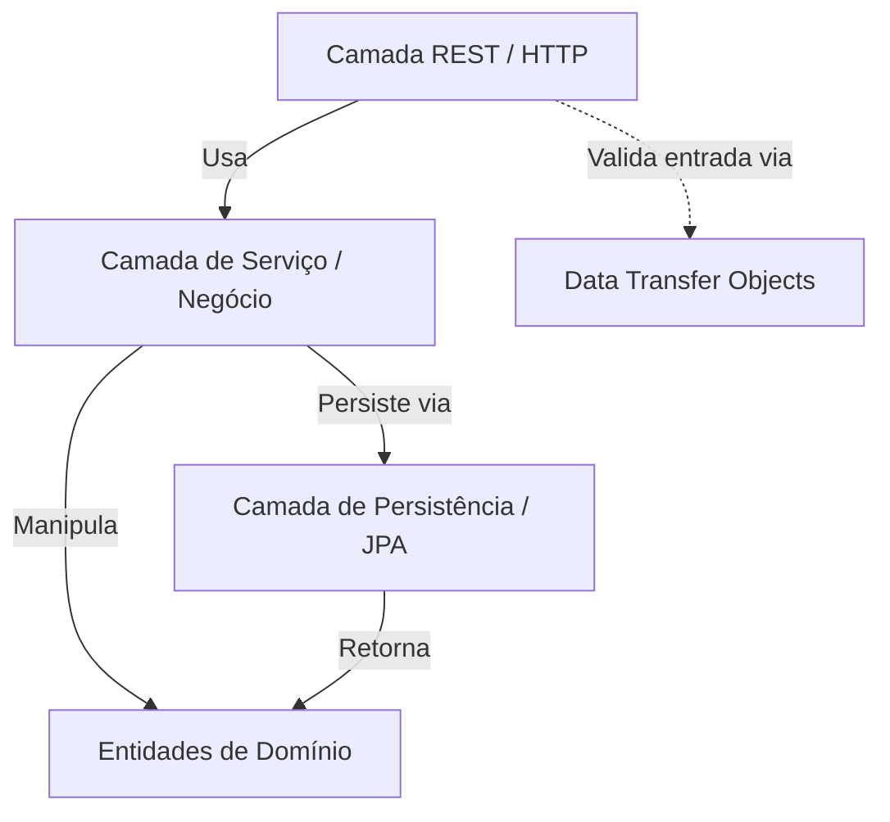
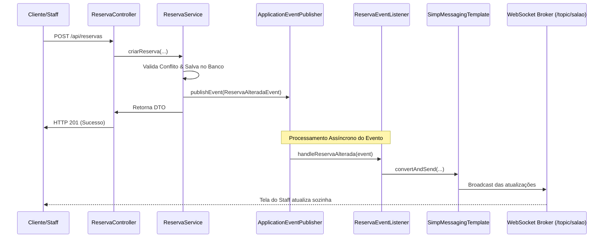

# Arquitetura do Sistema 

Este documento descreve detalhadamente as decisões arquiteturais, padrões de projeto e fluxo de dados do sistema **MesaLive**.

---

## 🏛️ 1. Estilo Arquitetural: Arquitetura em Camadas

O MesaLive utiliza uma **Arquitetura em Camadas (Layered Architecture)** inspirada nos princípios da **Clean Architecture** de maneira pragmática. O objetivo é isolar a lógica de negócio das tecnologias externas (bancos de dados, protocolos web e frameworks de interface).

### Diagrama de Dependências
As dependências do sistema seguem uma direção estrita de fora para dentro:

* A camada superior conhece a inferior, mas a inferior nunca conhece a superior.
  * O `Controller` delega a lógica de negócio para o `Service`.
  * O `Service` manipula o `Domain` e persiste dados usando o `Repository`.
  * O `Repository` e o `Service` nunca devem lidar com objetos HTTP (como `HttpServletRequest` ou `ResponseEntity`).
  * O `Domain` é a parte mais estável do software e não possui dependências de frameworks externos (exceto anotações JPA).

---

## ⚙️ 2. Lógica Central e Prevenção de Conflitos (Strategy Pattern)

Para gerenciar a disponibilidade de mesas no restaurante de forma extensível, foi implementado o **Strategy Pattern**.

* **Interface `DisponibilidadeValidator`:** Define um contrato simples para checagem de regras de agendamento.
* **Classe `ConflitoHorarioValidator`:** Implementação padrão do validador de colisão de horários.
  * **Regra da Janela de Ocupação:** Uma reserva é considerada em conflito se houver outra reserva com status `CONFIRMADA` na mesma mesa dentro de uma janela de tempo de **90 minutos** antes ou depois do horário desejado.
  * **Fórmula de Consulta:**
    * Início da busca: `dataHoraDesejada - 89 minutos`
    * Fim da busca: `dataHoraDesejada + 89 minutos`
    * Qualquer registro encontrado nesse intervalo dispara uma exceção `ConflitoReservaException` (HTTP 409).

---

## 📢 3. Comunicação em Tempo Real e Desacoplamento (Observer Pattern)

Para que a alteração de status no salão seja propagada instantaneamente para todos os garçons sem introduzir acoplamento entre as regras de banco de dados e a infraestrutura de rede, foi aplicado o **Observer Pattern** utilizando eventos do próprio Spring Framework:

---

## 🔒 4. Estratégia de Segurança e LGPD

### Segurança de Acessos
A autenticação do staff é **stateless** baseada em **JWT (JSON Web Tokens)**:
* Apenas o endpoint `POST /api/auth/login` permite autenticar e gerar o token.
* As rotas públicas (`/api/reservas/**` para criação/cancelamento pelo cliente, `/ws/**` para WebSocket e `/api/mesas/publicas`) não exigem token.
* As rotas administrativas (`/api/mesas/**`, `/api/reservas/**` (GET), etc.) exigem um token Bearer válido e as roles `ROLE_GARCOM` ou `ROLE_GERENTE`.

### Proteção de Dados (LGPD / GDPR)
* O endpoint de listagem de mesas do painel (`GET /api/mesas`) retorna dados sensíveis (nome do cliente e ID de reserva). Este endpoint é estritamente **privado**.
* O endpoint público (`GET /api/mesas/publicas`) retorna apenas a lista de mesas e suas respectivas capacidades para que o cliente escolha, sem revelar nenhuma informação de quem fez agendamentos anteriores.

---

## 🎨 5. Arquitetura do Frontend Angular 18

O frontend é composto por uma aplicação Single Page Application (SPA) construída com as melhores práticas modernas do ecossistema Angular:
* **Standalone Components:** Eliminação total de `NgModule`, tornando cada componente independente e reduzindo o tamanho final do pacote de compilação.
* **Angular Signals:** Utilizados no [auth.service.ts](file:///C:/Users/User/documents/MesaLive/frontend/src/app/services/auth.service.ts) para gerenciar o estado do usuário logado de forma reativa e eficiente, permitindo que a UI se redesenhe automaticamente em caso de login ou logout.
* **Gerenciamento de Fluxo do WebSocket:** O [websocket.service.ts](file:///C:/Users/User/documents/MesaLive/frontend/src/app/services/websocket.service.ts) encapsula o ciclo de vida da conexão SockJS e do cliente STOMP, gerenciando reconexões e expondo as atualizações como um fluxo observável (`Observable`) que é consumido pelo painel.
