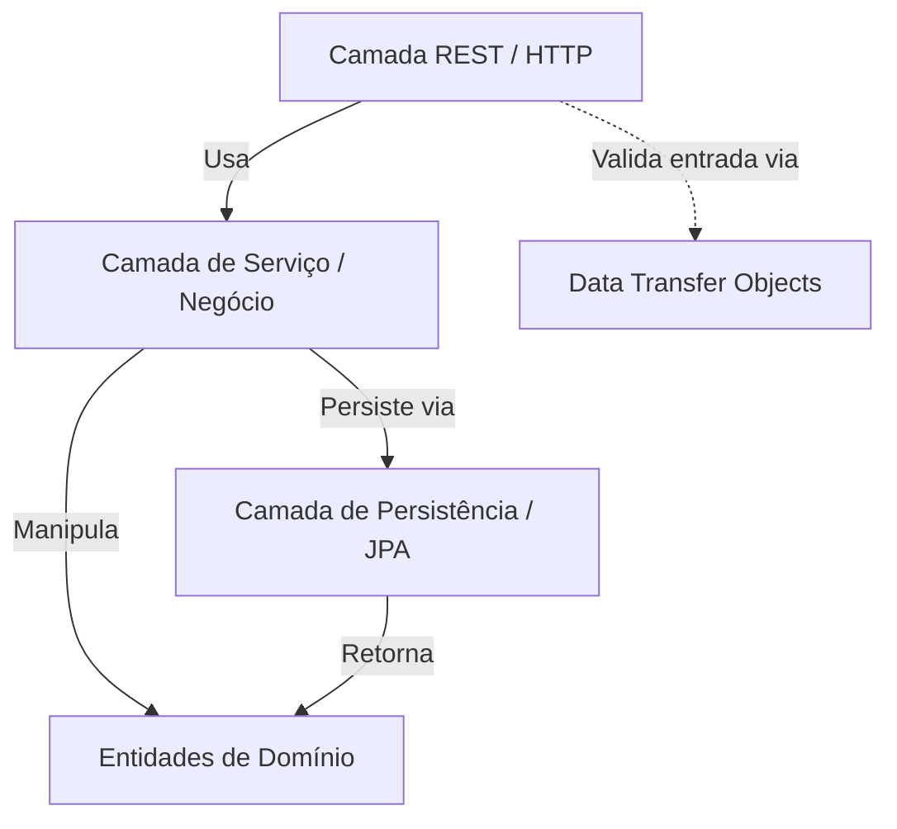
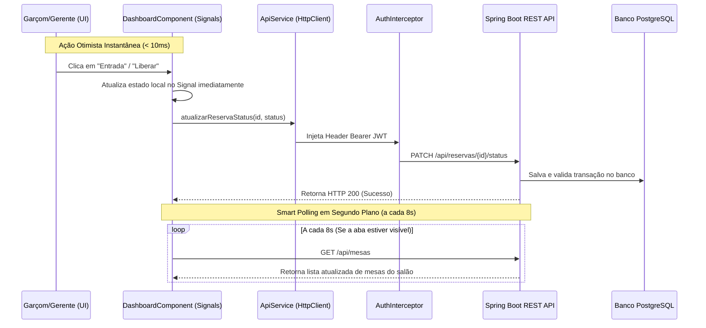

# Arquitetura do Sistema

Este documento descreve detalhadamente as decisões arquiteturais, padrões de projeto e fluxo de dados do sistema **MesaLive**.

---

## 🏛️ 1. Estilo Arquitetural: Arquitetura em Camadas

O MesaLive utiliza uma **Arquitetura em Camadas (Layered Architecture)** inspirada nos princípios da **Clean Architecture** de maneira pragmática. O objetivo é isolar a lógica de negócio das tecnologias externas (bancos de dados, protocolos web e frameworks de interface).

### Diagrama de Dependências
As dependências do sistema seguem uma direção estrita de fora para dentro:

* A camada superior conhece a inferior, mas a inferior nunca conhece a superior.
  * O `Controller` delega a lógica de negócio para o `Service`.
  * O `Service` manipula o `Domain` e persiste dados usando o `Repository`.
  * O `Repository` e o `Service` nunca devem lidar com objetos HTTP (como `HttpServletRequest` ou `ResponseEntity`).
  * O `Domain` é a parte mais estável do software e não possui dependências de frameworks externos (exceto anotações JPA).

---

## ⚙️ 2. Lógica Central e Prevenção de Conflitos (Strategy Pattern)

Para gerenciar a disponibilidade de mesas no restaurante de forma extensível, foi implementado o **Strategy Pattern**.

* **Interface `DisponibilidadeValidator`:** Define um contrato simples para checagem de regras de agendamento.
* **Classe `ConflitoHorarioValidator`:** Implementação padrão do validador de colisão de horários.
  * **Regra da Janela de Ocupação:** Uma reserva é considerada em conflito se houver outra reserva com status `CONFIRMADA` na mesma mesa dentro de uma janela de tempo de segurança antes ou depois do horário desejado.
  * **Fórmula de Consulta:**
    * Início da busca: `dataHoraDesejada - janelaSegurança`
    * Fim da busca: `dataHoraDesejada + janelaSegurança`
    * Qualquer registro encontrado nesse intervalo dispara uma exceção `ConflitoReservaException` (HTTP 409).

---

## 🔄 3. Sincronização Inteligente (Smart Polling + Optimistic UI)

Para garantir que o mapa do salão permaneça atualizado sem a fragilidade de conexões mantidas por WebSockets nem a sobrecarga de conexões abertas no servidor, o sistema utiliza **Smart Polling com RxJS** combinado com **Atualizações Otimistas de UI**:

### Vantagens dessa Arquitetura:
1. **Resiliência Total:** Sem reconexões de socket quebradas, falhas por proxies/firewalls ou vazamentos de memória de conexões no backend.
2. **Eficiência no Navegador:** O `timer` do RxJS valida `document.visibilityState === 'visible'`. Se a aba do restaurante for minimizada ou estiver em segundo plano, as consultas entram em pausa automática.
3. **Sensação de Resposta Instantânea (Optimistic UI):** Qualquer alteração feita pelo garçom atualiza a tela na mesma hora, sincronizando com o servidor em segundo plano.

---

## 🔒 4. Estratégia de Segurança e Proteção de Dados

### Segurança de Acessos
A autenticação do staff é **stateless** baseada em **JWT (JSON Web Tokens)** com **HttpInterceptor**:
* Apenas o endpoint `POST /api/auth/login` permite autenticar e gerar o token.
* As rotas públicas (`/api/reservas/**` para criação/cancelamento pelo cliente e `/api/mesas/publicas`) não exigem token.
* O `authInterceptor` injeta automaticamente o token Bearer em requisições administrativas (`/api/mesas/**`, `/api/usuarios`, etc.), validadas pelas roles `ROLE_GARCOM` ou `ROLE_GERENTE`.

### Proteção de Dados (LGPD)
* O endpoint de listagem de mesas do painel (`GET /api/mesas`) retorna dados operacionais (nome do cliente e ID de reserva). Este endpoint é estritamente **privado**.
* O endpoint público (`GET /api/mesas/publicas`) retorna apenas a lista de mesas e suas respectivas capacidades para que o cliente escolha no seletor visual em grid, sem revelar nenhuma informação de agendamentos de terceiros.

---

## 🎨 5. Arquitetura do Frontend Angular 18 & Design System Clean

O frontend é uma Single Page Application (SPA) moderna construída sob os padrões mais avançados do ecossistema Angular 18:
* **Standalone Components:** Eliminação total de `NgModule`, simplificando a árvore de módulos e otimizando o carregamento.
* **Angular Signals & Computeds:** Gerenciamento reativo de estado de autenticação e contadores do salão (`countTotal`, `countLivre`, `countOcupada`, etc.) que recalculam e re-renderizam o DOM de forma cirúrgica.
* **TypeScript Models:** Tipagem estrita de todas as estruturas de dados de API ([mesalive.models.ts](file:///C:/Users/User/Documents/mesalive/frontend/src/app/models/mesalive.models.ts)).
* **Design System SaaS Clean & Compatível com o Mercado:**
  * Tipografia baseada em `Manrope` (leitura), `Space Grotesk` (números/títulos) e `DM Mono` (códigos/tags).
  * Cantos arredondados de `14px` a `20px` e cartões suaves com bordas de destaque.
  * Seletor de mesas visual interativo em grid de cards para o cliente.
  * Visual minimalista e limpo sem emojis ou ícones poluídos.
