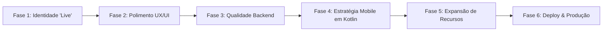
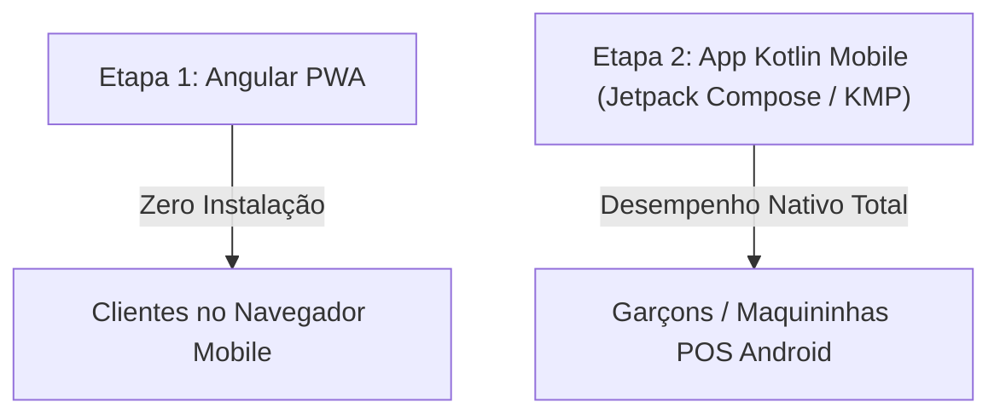

# MesaLive — Plano de Projeto & Roadmap de Desenvolvimento

> Documento oficial de planejamento. Consolida todas as próximas etapas de melhorias de UX/UI, 
> arquitetura, qualidade de código, estratégia mobile e evolução de funcionalidades para o ecossistema **MesaLive**.

---

## 📌 Visão Geral do Roadmap

---

## 🟢 Fase 1: Validação & Identidade "Live" da Marca MesaLive

Objetivo: Reforçar o conceito **MesaLive** (gestão de mesas + experiência viva em tempo real) tanto para o cliente final quanto para o staff.

* [ ] **1.1. Termômetro de Ocupação & Selo "Live" no Portal do Cliente**:
  * Adicionar no topo do [reserva-cliente.component.html](file:///C:/Users/User/Documents/mesalive/frontend/src/app/components/reserva-cliente/reserva-cliente.component.html) um indicador de disponibilidade em tempo real (ex: `🟢 75% das mesas disponíveis para hoje`).
  * Inserir badges `Disponível Agora` nos cards de mesas no seletor visual em grid.
* [ ] **1.2. Indicador `🔴 SALÃO AO VIVO` & Timer de Sincronização no Dashboard**:
  * Adicionar no cabeçalho do [dashboard.component.html](file:///C:/Users/User/Documents/mesalive/frontend/src/app/components/dashboard/dashboard.component.html) o sinalizador visual `🔴 SALÃO AO VIVO` e um relógio regressivo da próxima sincronização automática via Smart Polling (8s).
* [ ] **1.3. Feed de Atividades do Salão (Linha do Tempo "Live")**:
  * Implementar uma gaveta/painel lateral no dashboard listando o histórico recente de eventos (ex: *"Mesa 3 liberada às 19:14"*, *"Nova reserva efetuada na Mesa 5 por Carlos"*).

---

## 🎨 Fase 2: Polimento de UX & Usabilidade do Frontend

Objetivo: Elevar a ergonomia visual da aplicação ao nível dos principais softwares SaaS do mercado.

* [ ] **2.1. Modais de Confirmação Customizados**:
  * Substituir os diálogos `confirm()` e `alert()` nativos do navegador por componentes de modal elegantes e responsivos (estilo SaaS Clean), utilizados para confirmações de cancelamento de reserva, liberação de mesa ou desativação.
* [ ] **2.2. Filtros e Busca Rápida no Painel do Salão**:
  * Adicionar barra de pesquisa por número/nome da mesa.
  * Inserir botões de filtro rápido por status (`Livres`, `Reservadas`, `Ocupadas`, `No-Show`, `Inativas`).
* [ ] **2.3. Máscara de Formatação de Telefone / WhatsApp**:
  * Aplicar formatação automática de telefone no padrão `(00) 00000-0000` nos formulários do cliente e do staff.

---

## 🛡️ Fase 3: Qualidade, Segurança & Validação do Backend

Objetivo: Fortalecer a integridade dos dados e as regras de negócio no ecossistema Spring Boot / Kotlin.

* [ ] **3.1. Validação Estrita de DTOs (Bean Validation)**:
  * Inserir anotações Jakarta Validation (`@field:NotBlank`, `@field:Email`, `@field:Min`, `@field:Max`, `@field:Pattern`) em todos os DTOs de entrada do Spring Boot.
* [ ] **3.2. Cálculo da Janela de Permanência (Turnos da Mesa)**:
  * Garantir no [ReservaServiceImpl.kt](file:///C:/Users/User/Documents/mesalive/backend/src/main/kotlin/com/mesalive/service/impl/ReservaServiceImpl.kt) que a validação de sobreposição considere uma janela de permanência padrão (ex: 2 horas por reserva), permitindo que a mesma mesa física seja agendada no 1º e no 2º turno do mesmo dia.
* [ ] **3.3. Cobertura de Testes Automatizados**:
  * Executar e expandir a suíte de testes unitários (`./gradlew test`) com MockK para cobrir 100% dos cenários de borda na colisão de reservas.

---

## 📱 Fase 4: Estratégia Mobile em Kotlin & Experiência de Salão

Objetivo: Garantir uso ágil e fluido do sistema nos smartphones e dispositivos móveis de clientes e garçons.

### 4.1. Abordagem Híbrida em 2 Etapas (Web PWA + App Kotlin Mobile)

* [ ] **4.1. Etapa 1: PWA (Progressive Web App com Angular)** *(Experiência de Cliente sem Fricção)*:
  * Adicionar suporte a `@angular/pwa` no frontend.
  * O cliente lê um **QR Code** ou clica em um link e faz o agendamento de forma 100% autônoma no celular, **sem necessidade de baixar aplicativo em loja de apps**.
  * Permite ao staff "Adicionar à Tela Inicial" e usar o sistema em tela cheia com resposta tátil (`navigator.vibrate`).
* [ ] **4.2. Etapa 2: Aplicativo Mobile Nativo em Kotlin (Jetpack Compose & Kotlin Multiplatform)** *(Para o Staff/Garçons)*:
  * **Unificação Tecnológica**: Mesma linguagem Kotlin utilizada no backend (`backend/`), permitindo reutilizar 100% dos DTOs e modelos de dados.
  * **Desenvolvimento com Jetpack Compose / KMP**:
    * Interface nativa ultrarrápida compilada para **Android** (celulares, tablets e maquininhas de cartão POS como PagBank, Clover, Sunmi) e **iOS**.
    * **Integração com Hardware**: Leitura de QR Code pela câmera do dispositivo para identificação de mesa.
    * **Impressão Bluetooth de Comanda**: Envio de dados diretamente para impressoras térmicas portáteis de cinto do garçom.
    * **Notificações e Vibração Nativa**: Alerta no bolso do garçom ao receber novas reservas ou confirmações de chegada no salão.

---

## 🚀 Fase 5: Expansão de Features Futuras (Roadmap de Produto)

Objetivo: Expandir a proposta de valor do produto para um sistema completo de gestão de restaurantes.

* [ ] **5.1. Gestão de Pedidos & Comandas por Mesa (Ordens de Consumo)**:
  * Vinculação de itens do cardápio à mesa ocupada no salão.
  * Lançamento de consumo feito pelo garçom no app Kotlin ou via QR Code na mesa pelo cliente.
  * Exibição do valor acumulado da comanda em tempo real no card da mesa.
* [ ] **5.2. CRUD de Mesas Físicas no Painel do Gerente**:
  * Interface gráfica para o gerente adicionar novas mesas físicas, alterar número e capacidade de assentos, ou realizar exclusão lógica.
* [ ] **5.3. Painel KDS (Kitchen Display System) para Cozinha**:
  * Tela dedicada para a equipe de cozinha visualizar os pedidos lançados nas mesas em tempo real, organizados por status (*Na Fila*, *Em Preparo*, *Pronto para Entrega*).

---

## 🐳 Fase 6: Infraestrutura & Produção

Objetivo: Preparar a aplicação para implantação em ambiente cloud de alta disponibilidade.

* [ ] **6.1. Variáveis de Ambiente (`environment.ts` / `environment.prod.ts`)**:
  * Mover URLs base de API REST (`http://localhost:8080/api`) para arquivos de configuração do Angular.
* [ ] **6.2. Build de Produção e Orquestração Docker**:
  * Gerar build minificado do Angular (`ng build --configuration production`).
  * Atualizar o `docker-compose.yml` para orquestrar o container PostgreSQL, a API Spring Boot (JAR executável) e o servidor Nginx servindo o frontend estático.
